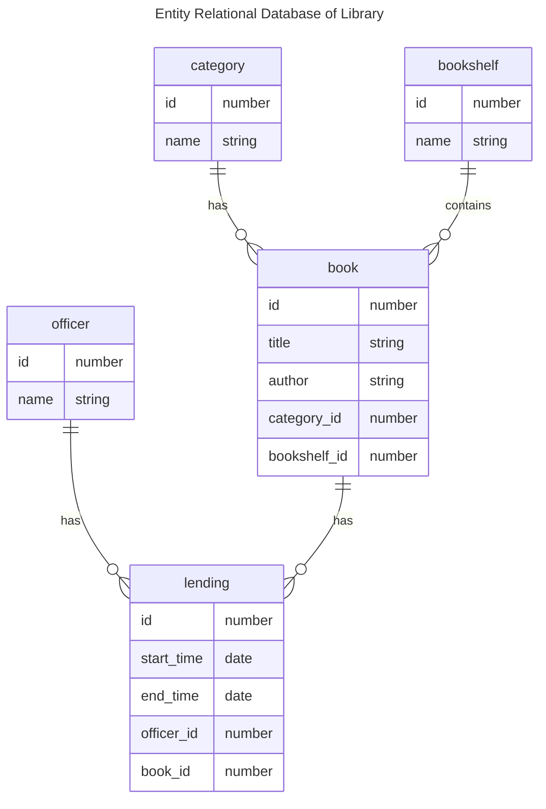

```mermaid
---
title: Entity Relational Database of Library
---
erDiagram

category ||--o{book :has
book {
    id number
    title string
    author string
    category_id number
    bookshelf_id number
}

category{
    id number
    name string
}

bookshelf||--O{ book :contains
bookshelf{
    id number
    name string
}

officer ||--o{ lending :has
officer {
    id number
    name string
}
lending {
    id number
    start_time date
    end_time date
    officer_id number
    book_id number
}
book ||--o{ lending : has

```
https://dbdiagram.io/d/library-erd-6aa8be41957fec6d5bf5ff25
