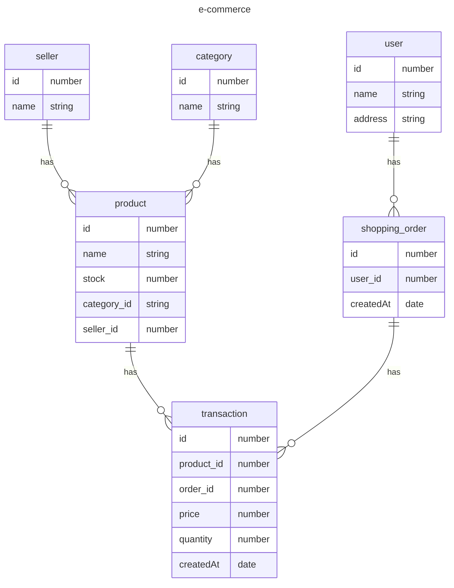
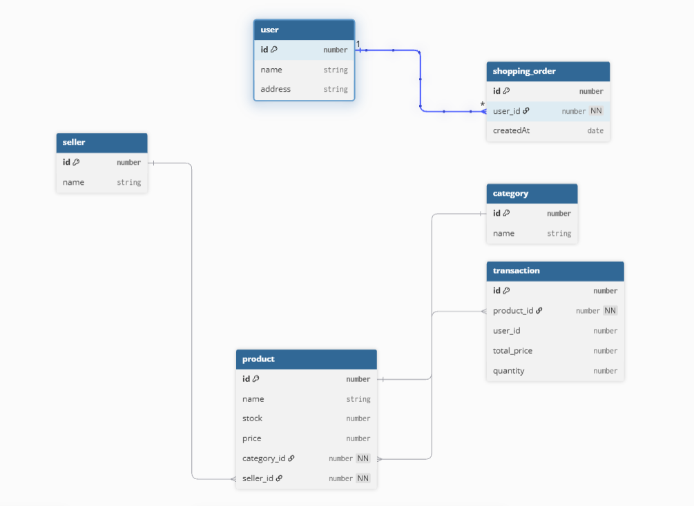

``` mermaid
---
title: e-commerce
---
erDiagram

user {
    id number
    name string
    address string

}

product {
    id number
    name string
    stock number
    category_id string
    seller_id number
}

category {
    id number
    name string
}

shopping_order {
    id number 
    user_id number
    createdAt date
}

transaction {
    id number 
    product_id number
    order_id number
    price number
    quantity number
    createdAt date
}

seller {
    id number
    name string

}


seller ||--o{ product :has
user ||--o{shopping_order:has
category ||--o{product:has
product ||--o{transaction:has
shopping_order ||--o{transaction:has

```
https://dbdiagram.io/d/e-commerce-6aa93341fe722b4a39f5fb5d

